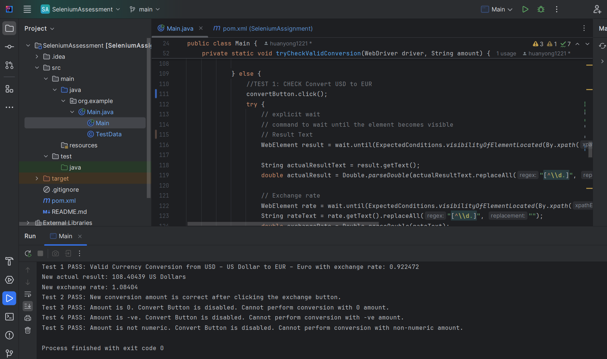

Assignment

MODE FAIR HOME ASSESSMENT

**Question 1**

Prepare at least 5 automation scenarios and test cases (table format) for the Convert module as detailed as possible so you can ensure the functionality works as planned.

Website : https://www.xe.com/

**Convert Module Test Scenarios and Test Cases**

| **S.No** | **Scenario**                                       | **Test Cases Description**                                                                                                              | **Input** | **Expected Output**                                                                            | **Actual Output**                                                                              | **Test Result** |
|----------|----------------------------------------------------|-----------------------------------------------------------------------------------------------------------------------------------------|-----------|------------------------------------------------------------------------------------------------|------------------------------------------------------------------------------------------------|-----------------|
| S001     | Verification of valid currency conversion          | Verify that converting a valid amount from USD to EUR is performed accurately using the current exchange rate                           | 100       | Conversion should be correct with the output amount in EUR                                     | Conversion should be correct with the output amount in EUR                                     | Pass            |
| S002     | Verification of switching currencies               | Verify that switching the currencies (from EUR to USD) and converting the amount is performed correctly using the current exchange rate | 100       | The currency should be switched when converting, and the conversion results should be correct. | The currency should be switched when converting, and the conversion results should be correct. | Pass            |
| S003     | Verification of conversion with zero amount        | Verify that attempting to convert an amount of 0 USD to EUR                                                                             | 0         | The convert button should be disabled and no conversion should be performed                    | The convert button should be disabled and no conversion should be performed                    | Pass            |
| S004     | Verification of conversion with Negative Amount    | Verify that attempting to convert a negative amount from USD to EUR                                                                     | -100      | The convert button should be disabled and no conversion should be performed                    | The convert button should be disabled and no conversion should be performed                    | Pass            |
| S005     | Verification of conversion wirh alphabetical input | Verify that entering a non-numeric value (e.g., "abcdefg") as the amount                                                                | abcdefg   | The convert button should be disabled and no conversion should be performed                    | The convert button should be disabled and no conversion should be performed                    | Pass            |

**Output**

